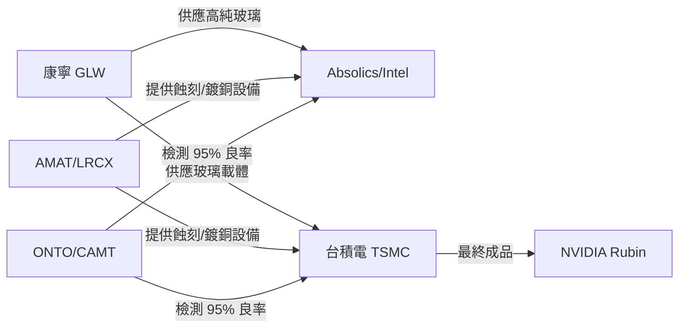

import Callout from '../../../../components/Callout.astro';

在台股的分析中，我們提到了台積電為了因應 B200 之後（如 Rubin 架構）超大型晶片的封裝需求，正全力轉向 **CoPoS (Chip-on-Panel-on-Substrate)**。
但如果台積電是「代工者」，美股公司則掌握了這場玻璃革命的「材料配方」與「檢測儀器」。

這不是一場局限於亞洲的變革，而是一次美日台聯手的半導體物理突破。

---

## 一、為什麼「玻璃」是美股的核心敘事？

目前的有機基板（Organic Substrate）在超過 100x100mm 的尺寸時會像洋芋片一樣彎曲（Warpage），導致良率崩潰。
美國政府正透過《晶片法案》（CHIPS Act）大力扶持本土的玻璃封裝供應鏈，目標是讓 AI 晶片的連接密度提升 10 倍。

<Callout type="data" title="玻璃封裝的美股關鍵指標">
| 廠商 | 代號 | 核心角色 | 關鍵優勢 |
| :--- | :--- | :--- | :--- |
| **Corning** | **GLW** | 材料供應 | 全球唯一能大規模供應 ultra-flat 高純度玻璃 |
| **Onto Innovation** | **ONTO** | 檢測設備 | 控制玻璃基板微裂痕與 TGV 對準的霸主 |
| **Applied Materials** | **AMAT** | 薄膜/蝕刻 | 提供面板級 PVD 設備，並投資 Absolics 玻璃廠 |
| **Intel** | **INTC** | 整合領先 | 領先台積電兩年宣布玻璃基板計畫，2025 年試產 |
</Callout>

---

## 二、深度解析：三大受惠環節

### 1. 康寧 (Corning, GLW)：封裝的「地基」
如果說 CoPoS 是一棟大樓，康寧就是那塊地。
康寧開發的「Fusion」製程可以拉出原子級平坦的玻璃，其熱膨脹係數（CTE）與矽晶圓完美匹配。
*   **投資邏輯**：隨 AI 晶片面積從 800mm² 翻倍至 1500mm²，康寧供應的玻璃基板面積與產值將呈指數成長。
*   **催化劑**：2026 年台積電試產線對高純度玻璃玻璃載板（Glass Carrier）的大量採購。

### 2. Onto Innovation (ONTO) & Camtek (CAMT)：良率的「守門人」
玻璃是透明且脆弱的，傳統矽晶圓的檢測儀器在玻璃上會「看不見」微小的裂縫。
*   **Onto (ONTO)**：其 Firefly 系列是 Panel-level 封裝的標準設備。隨著 CoPoS 從圓形轉方形，面板級檢測需求暴增。
*   **Camtek (CAMT)**：其 Golden Eagle 系統專攻方形面板（650mm x 650mm），目前在先進封裝市佔率極高。

### 3. Intel (INTC)：老牌巨頭的封裝逆襲
雖然 Intel 在代工領域苦戰，但在玻璃基板技術上，它是「領先者」而非追隨者。
*   Intel 已在亞利桑那州投資超過 10 億美元開發玻璃基板。
*   **戰略價值**：Intel 試圖繞過 CoWoS 的專利壁壘，直接在玻璃封裝時代定義新標準。若 2026 年 Intel 的玻璃基板產品良率領先台積電，其 Foundry 事業部將獲得強大議價權。

---

## 三、CoPoS 供應鏈：台美聯手架構

---

## 四、投資策略：現在該看什麼？

<Callout type="insight" title="三大檢查點 (Checkpoints)">
1. **ONTO 的訂單預測**：如果 ONTO 在法說會中提到「Panel-level Packaging」設備營收佔比超過 30%，代表玻璃化進程加速。
2. **康寧的資本支出**：觀察其 Specialty Glass 部門是否針對半導體應用擴產。
3. **NVIDIA 的技術認證**：一旦黃仁勳在 GTC 大會提到「Glass Core」或「Panel Architecture」，這將是整個族群的主升段開始。
</Callout>

**一句話總結：**
CoPoS 不是要把 CoWoS 淘汰，而是要把封裝從「手工藝術」變成「面板工業」。在這個過程中，掌握材料（康寧）與量測儀器（Onto）的美股公司，擁有比代工廠更高的毛利率潛力。
