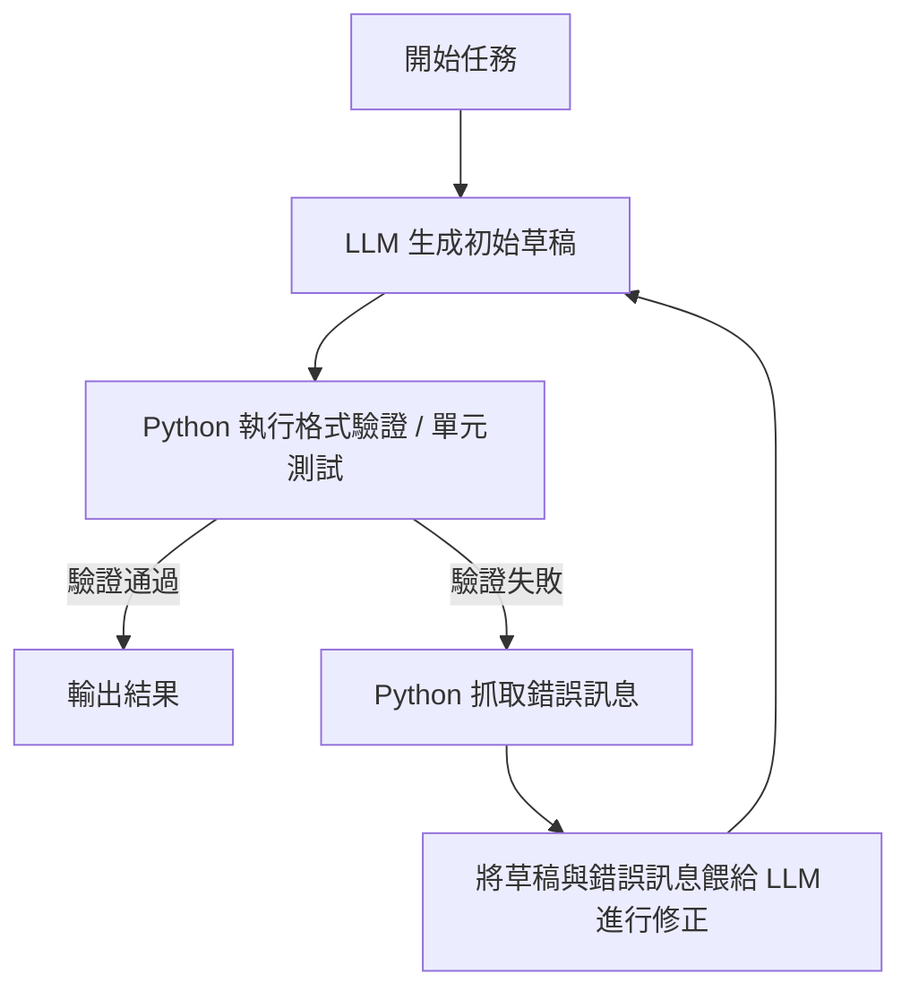

在 LLM 與 AI 應用開發的社群中，有一句非常經典的警醒語：**「別再 Prompt，去寫 Loop」**（Stop prompting, start looping）。

這句話精準地指出了許多開發者在打造 AI 應用時面臨的瓶頸：當你發現自己花費了數天時間，寫了上千字的 Prompt，試圖約束 AI 的輸出格式、重試機制和邊界條件，卻依然無法阻止它在 5% 的情況下出錯或遺忘指令時——這代表你該**將控制權交還給程式碼控制流**了。

---

### 1. 提示詞工程（Prompt Engineering）的「天花板」

在開發初期，我們習慣於把 LLM 當成一個「全能大腦」，試圖通過一長串提示詞讓它一次性完成所有任務：
> *「你是一個翻譯官，請先翻譯這段話，然後檢查是否有政治敏感詞，如果有，請重新翻譯，最後以 JSON 格式輸出，並且 JSON 欄位必須包含...」*

這種做法存在幾個致命的缺點：
1. **機率性而非確定性**：LLM 本質上是下一個 Token 的機率預測模型。不論你的 Prompt 寫得多完美，都無法保證 100% 的輸出一致性。
2. **上下文膨脹與指令遺忘**：Prompt 越長，模型注意力的焦點就越分散，越容易漏掉中間的某個約束條件。
3. **難以調錯（Debug）**：當單次 Prompt 輸出失敗時，很難定位到底是「翻譯」錯了、「敏感詞檢查」錯了，還是「格式化」錯了。

---

### 2. 什麼是 「Loop」（工作流思維）？

「寫 Loop」的本質，是將複雜的任務拆解，並以**確定性的程式邏輯（如 Python/TypeScript）**將**機率性的 LLM** 包裹起來，形成一個**自我修正與控制的閉環（Control Loop）**。

其公式可以簡化為：
$$\text{Workflow} = \text{Python (確定性控制流)} + \text{LLM (模糊性判讀/生成)}$$

#### 經典的自我修正循環（Reflexion Loop）：
不用一句 Prompt 叫 LLM 直接給出完美結果，而是寫一個程式迴圈：

在這個 Workflow 中：
* **LLM** 只專注於「寫草稿」與「根據錯誤訊息改寫草稿」。
* **Python** 負責當嚴格的裁判（檢查 JSON 格式、執行代碼驗證、控制最大重試次數 `max_retries = 3`）。

---

### 3. 從 Prompt 到 Workflow 的合作分工

當思維轉變後，開發者的角色從「魔術師（調整 Prompt 咒語）」變成了「系統架構師」。我們可以將工作進行清晰的分工：

* **Python/程式碼（負責「確定性」與「骨架」）**：
  * 使用 `Pydantic` 嚴格限制 API 回傳的資料結構。
  * 控制流程跳轉（`if/else`）、重複嘗試（`while` 迴圈）。
  * 呼叫外部工具（資料庫、搜尋引擎、外部 API）。

* **LLM（負責「語意理解」與「肌肉」）**：
  * 判讀用戶意圖。
  * 提取非結構化文本的關鍵資訊。
  * 在規則框架內生成高品質的內容。

---

### 結論

微調 Prompt 只能幫你把應用的成功率從 70% 提升到 85%；但想要達到商業落地的 99% 穩定性，就必須依靠**控制流（Loop）與工作流（Workflow）**的架構設計。

下一次當你發現 LLM 不聽話時，先別急著修改 Prompt。問問自己：**「我是不是可以用幾行 If-Else 或一個 While 迴圈，把這個壓力從 LLM 身上拿下來？」**
